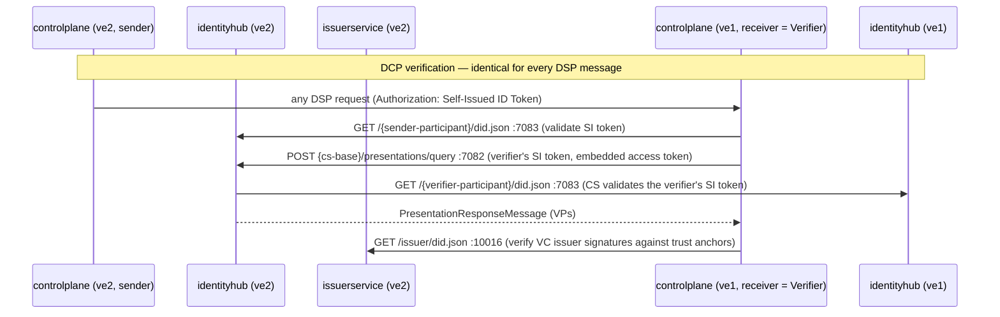
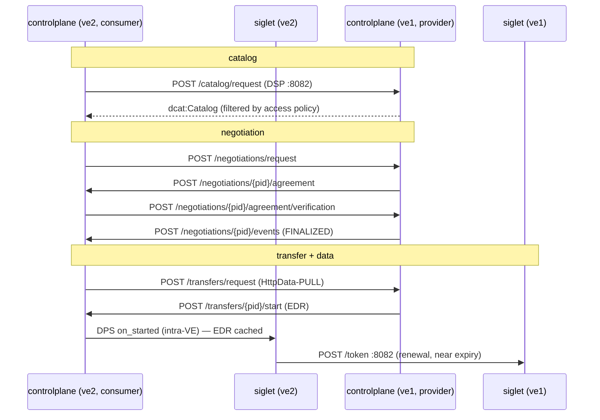

# Cross-VE communication

Every network request that crosses the boundary between two connected VEs (as set up by
`scripts/install-ve.sh` + `scripts/connect-ves.sh`, exercised end to end by
`scripts/dsp-tests.sh`). Concrete hostnames/ports below use the dual-VE convention — ve1
(`ve1.local`) in the provider role, ve2 (`ve2.local`) in the consumer role — but every flow is
symmetric: whichever VE initiates a catalog request is the consumer for that exchange.

A key architectural fact up front: **cross-VE traffic never passes through the gateways**
(Traefik/clearglass). All of it is pod-to-pod HTTP between in-cluster FQDNs
(`<svc>.edc-v.svc.<peer-domain>:<port>`), riding on the static routes and DNS forwarding below.
DSP and DCP bring their own authentication (self-issued ID tokens + verifiable presentations),
so the platform's edge auth chain is not involved between VEs.

The surface is deliberately exactly **DCP (layers 1–2) and DSP plus the agreed data-plane
profile (layers 3–4)** — that is the complete wire contract a third-party implementation must
speak to interoperate. Layer 0 is lab plumbing, not part of the contract. See
[sut-verification.md](sut-verification.md) for how this surface is used to verify a candidate
("system under test") that replaces ve2.

## Layer 0 — infrastructure prerequisites (harness plumbing, set up by connect-ves.sh)

| Flow | From → To | Purpose |
|---|---|---|
| IP routing | kind node ↔ kind node (docker `kind` network) | Static routes for the peer's pod + service CIDRs via the peer node's IP. Not a request flow itself, but every flow below depends on it. Does **not** survive a container restart. |
| DNS | CoreDNS (ve2) → kube-dns ClusterIP (ve1), port 53 UDP/TCP, and vice versa | Zone forwarding of the peer's cluster domain (`ve1.local:53 { forward . <ve1-kube-dns> }`), so `<svc>.edc-v.svc.ve1.local` names resolve from inside ve2. Every cross-VE HTTP call is preceded by such a DNS query (subject to CoreDNS caching, `cache 30`). |

## Layer 1 — identity resolution (DCP: did:web)

Both control planes resolve the counterparty's DIDs by plain HTTP GET. The URLs are derived
from the DID (`did:web:<host>%3A<port>:<path>` → `http://<host>:<port>/<path>/did.json`); the
IdentityHub serves DID documents virtual-host style, so the `Host` header must match the DID.

| # | From → To | Request | Purpose |
|---|---|---|---|
| 1 | controlplane (ve2) → identityhub (ve1) `:7083` | `GET /alphamanufacturing-<suffix>/did.json` | Resolve the provider participant's DID document: verification key for its Self-Issued ID Tokens, plus its service endpoints (DSP `ProtocolEndpoint`, DCP `CredentialService`). |
| 1a | identityhub (ve2) → identityhub (ve1) `:7083` | `GET /alphamanufacturing-<suffix>/did.json` | The consumer's Credential Service resolves the **verifier's** DID when validating the Self-Issued ID Token that ve1's controlplane presents with its presentation query (#5) — per DCP, the verifier's query is itself SI-token-authenticated. |
| 2 | controlplane (ve1) → identityhub (ve2) `:7083` | `GET /betalogistics-<suffix>/did.json` | Same as #1, in the other direction — the provider verifies the consumer on every inbound DSP message. |
| 2a | identityhub (ve1) → identityhub (ve2) `:7083` | `GET /betalogistics-<suffix>/did.json` | Mirror of #1a: ve1's Credential Service validates the SI token ve2's controlplane presents with #6. |
| 3 | controlplane (ve2) → issuerservice (ve1) `:10016` | `GET /issuer/did.json` | Resolve the peer VE's **issuer** DID to obtain the key material for verifying credential signatures inside received presentations. This is the fetch `connect-ves.sh` uses as its smoke test. Requires the issuer's DID in `edc.controlplane.trustedIssuers` *and* its `supportedtypes` ConfigMap entry (see connect-ves.sh). |
| 4 | controlplane (ve1) → issuerservice (ve2) `:10016` | `GET /issuer/did.json` | Same, other direction. |

DID documents and presentations may be cached by implementations, so the wire-level frequency
can be lower than the logical model suggests — the *logical* model is per-message.

The participant DID document advertises the endpoints used by the layers below (values from a
live deployment):

```json
"service": [
  { "type": "ProtocolEndpoint",
    "serviceEndpoint": "http://controlplane.edc-v.svc.ve1.local:8082/api/dsp/<ctx>/http-dsp-profile-2025-1" },
  { "type": "DataService",
    "serviceEndpoint": "http://controlplane.edc-v.svc.ve1.local:8082/api/dsp/<ctx>/.well-known/dspace-version" },
  { "type": "CredentialService",
    "serviceEndpoint": "http://identityhub.edc-v.svc.ve1.local:7082/api/credentials/v1/participants/<ctx>" }
]
```

The DSP base path pattern is `/api/dsp/{participant-context-id}/{dataspace-profile}`; the
Catena-X deployment exchanges over the `cx-neptune` profile (the DID document additionally
advertises the default `http-dsp-profile-2025-1` binding).

## Layer 2 — presentation exchange (DCP: identity & credentials)

DCP defines **one invariant flow, identical for every DSP message** — there is nothing
catalog-, negotiation- or transfer-specific about it. DSP requires only that every request
carries an `Authorization` token (semantics delegated to the identity layer); with DCP that
token is a Self-Issued ID Token (`iss` = `sub` = sender DID, `aud` = receiver DID, plus a
`token` claim carrying an access token for the sender's Credential Service). On each inbound
DSP message the **receiver** acts as DCP Verifier:

1. Validate the SI token — resolve the sender's DID document for the signing key (#1/#2).
2. Discover the sender's Credential Service from the DID document (`service` entry of type
   `CredentialService`).
3. `POST <cs>/presentations/query` (`PresentationQueryMessage`, scope-based here) — bearing
   the verifier's *own* SI token with the sender's access token embedded in the `token`
   claim; validating that token is what triggers the reverse DID resolution (#1a/#2a).
4. Validate the returned Verifiable Presentations: VP signature (holder key), each VC's
   issuer signature (issuer DID resolution, #3/#4, checked against the trust anchors) and,
   where present, revocation status.

The credentials checked in this deployment are Membership, BpnCredential and
DataExchangeGovernance — the demo policy requires all three:

| # | From → To | Request | When |
|---|---|---|---|
| 5 | controlplane (ve1) → identityhub (ve2) `:7082` | `POST /api/credentials/v1/participants/<cons-ctx>/presentations/query` | On every DSP request the consumer sends (catalog request, contract request, verification, transfer request). |
| 6 | controlplane (ve2) → identityhub (ve1) `:7082` | `POST /api/credentials/v1/participants/<prov-ctx>/presentations/query` | On every DSP callback the provider sends (agreement, finalized event, transfer start). |

Credential *signature* verification uses the issuer DID documents from layer 1. Credentials
carrying a `credentialStatus` reference would additionally cause the verifier to fetch the
issuer's status-list credential cross-VE; the Onboarding API's issuance flow does not
configure status lists, so no such fetches occur here.

## Layer 3 — DSP (catalog → negotiation → transfer)

The Dataspace Protocol is asynchronous: the consumer calls the provider's DSP endpoint, and
the provider *calls back* to the consumer's DSP endpoint (the `callbackAddress` sent in each
request — the consumer's own `/api/dsp/<cons-ctx>/cx-neptune` base). Both directions target
`controlplane.<ns>.svc.<peer-domain>:8082`.

| # | Direction | Request (relative to the peer's DSP base) | Purpose |
|---|---|---|---|
| 7 | ve2 → ve1 | `GET /.well-known/dspace-version` | Protocol version/metadata discovery (advertised as the `DataService` in the DID document). |
| 8 | ve2 → ve1 | `POST /catalog/request` | Catalog request (`dcat:Catalog` response filtered by the consumer's presented credentials — the access policy). |
| 9 | ve2 → ve1 | `POST /negotiations/request` | `ContractRequestMessage` — starts the negotiation, mirroring the offer policy verbatim. |
| 10 | ve1 → ve2 | `POST /negotiations/{consumerPid}/agreement` | `ContractAgreementMessage` callback. |
| 11 | ve2 → ve1 | `POST /negotiations/{providerPid}/agreement/verification` | `ContractAgreementVerificationMessage`. |
| 12 | ve1 → ve2 | `POST /negotiations/{consumerPid}/events` | `ContractNegotiationEventMessage` (FINALIZED). |
| 13 | ve2 → ve1 | `POST /transfers/request` | `TransferRequestMessage` (`HttpData-PULL`). |
| 14 | ve1 → ve2 | `POST /transfers/{consumerPid}/start` | `TransferStartMessage` — carries the **EDR** (data address: endpoint + provider-siglet-minted access token). The consumer control plane hands it to its siglet via data-plane signaling (intra-VE). |
| — | either | `POST /negotiations/{pid}/termination`, `POST /transfers/{pid}/termination` | Error/termination paths, when an exchange is aborted. |

## Layer 4 — data plane (DSP HttpData-PULL profile, steady state after STARTED)

| # | From → To | Request | Purpose |
|---|---|---|---|
| 15 | siglet (ve2) → siglet (ve1) `:8082` | `POST /token` (OAuth2-style refresh, endpoint from `SIGLET__TOKEN__REFRESH_ENDPOINT`, e.g. `http://siglet.edc-v.svc.ve1.local:8082/token`) | Automatic renewal of the EDR access token when a cached token nears expiry (`tx_renewal_support = true` for `HttpData-PULL`). The consumer siglet does this transparently for applications reading `GET /tokens/{ctx}/{transfer-id}`. |
| 16 | application → EDR endpoint | `GET <endpoint>` with `Authorization: Bearer <EDR token>` | The actual data pull. In the demo deployment the endpoint is the external sample source (`https://jsonplaceholder.typicode.com/todos/1`), so this request leaves both VEs; with a provider-hosted data source it would be another ve2 → ve1 flow. |

## What does *not* cross the VE boundary

NATS, Vault, PostgreSQL, jwtlet, clearglass/Traefik, the Tenant Manager/CFM agents and the
Onboarding API only ever talk within their own VE. Credential **issuance** is also intra-VE
(each participant's IdentityHub talks to its own VE's IssuerService); only issuer DID
*resolution* crosses over (layer 1). Management-API traffic (as driven by `dsp-tests.sh`)
enters each VE from the host through that VE's own gateway and never hops between VEs.

## Sequence overview

The DCP verification pattern is drawn once — it runs identically for **every** DSP arrow in
the second diagram, with Verifier = the receiver of that arrow (mirror the components for
callbacks, where ve2 verifies ve1).




